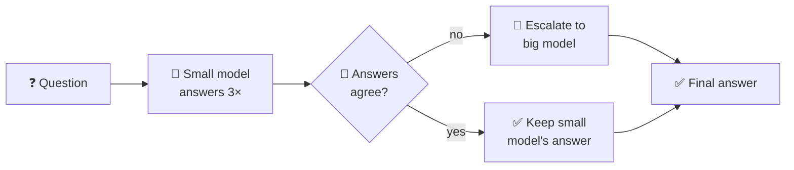

# 🔀 SLM Cascading Router


> A small local model answers first, and only asks for help when it disagrees with itself.

## ⚙️ How it works



- **Self-consistency:** sample the small model 3× (temperature 0.8) and measure how similar the answers are.
- **Escalate** when agreement drops below **0.75**.
- **Score** answers against ground truth with `all-MiniLM-L6-v2` (similarity ≥ 0.55 = correct).

## 📊 Results (350 medical questions)

| | |
|---|---|
| 🎯 Accuracy, small model alone | **74.0%** |
| 🚀 Accuracy, with routing | **76.6%** |
| 📤 Questions escalated | **6.9%** (24 / 350) |
| 🪤 Wrong answers caught | **15.4%** (14 / 91) |
| 🛠️ Caught answers fixed by big model | **9 / 14** |
| 🛡️ Correct answers broken | **0** |

💡 **Takeaway:** escalating ~7% of questions catches ~15% of errors and never makes an answer worse. The blind spot: a model that's *consistently* wrong looks confident.

## 🚀 Run it

```bash
ollama pull qwen2.5:1.5b
pip install -r requirements.txt
export OPENAI_API_KEY="sk-..."   # or set BIG_MODEL_BACKEND = "ollama" to stay fully local
python router_demo.py
```

## 📁 Files

| | |
|---|---|
| `router_demo.py` | The router: sample → score → escalate → evaluate |
| `dataset_prep.py` | Builds the 120-question stratified pilot from MedHallu |
| `dataset_prep_extend.py` | Extends it to 350, keeping the original 120 |
| `data/` | The 120- and 350-question subsets |
| `results/router_results.csv` | Per-question results |

## 📚 Dataset & licence

`data/` contains subsets of **MedHallu** (MIT licence), whose questions come from **PubMedQA** (MIT). Please cite the originals:

- Pandit et al., *MedHallu: A Comprehensive Benchmark for Detecting Medical Hallucinations in Large Language Models*, 2025 · [arXiv](https://arxiv.org/abs/2502.14302) · [GitHub](https://github.com/MedHallu/MedHallu) · [Hugging Face](https://huggingface.co/datasets/UTAustin-AIHealth/MedHallu)
- Jin et al., *PubMedQA: A Dataset for Biomedical Research Question Answering*, EMNLP 2019 · [GitHub](https://github.com/pubmedqa/pubmedqa)
